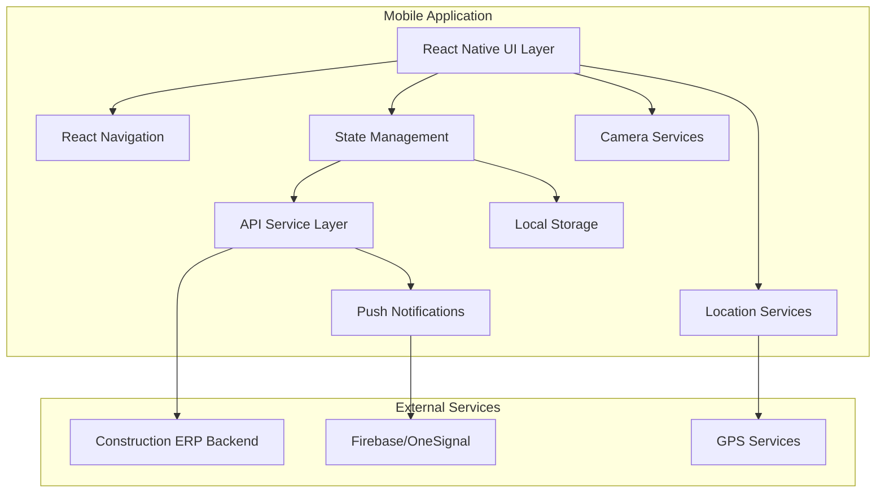

# Design Document: Construction ERP Mobile Application

## Overview

The Construction ERP Mobile Application is a React Native cross-platform mobile application designed for construction site workers, supervisors, and drivers. The application provides role-based access to construction management features including attendance tracking, task management, daily reporting, and request management.

The application follows a client-server architecture where the mobile app serves as a frontend client consuming REST APIs from an existing backend system. The design emphasizes offline-first capabilities, location-based services, and construction site-optimized user experience.

### Key Design Principles

- **API-First Integration**: All business logic resides in the backend; the mobile app is a pure client
- **Role-Based Access Control**: UI and navigation adapt based on user roles (Worker, Supervisor, Driver)
- **Location-Aware Operations**: GPS and geofencing integration for attendance and task validation
- **Offline-First Design**: Graceful degradation when network connectivity is limited
- **Construction-Optimized UX**: Large touch targets, minimal typing, high contrast UI

## Architecture

### High-Level Architecture



### Technology Stack

- **Framework**: React Native (latest stable)
- **Language**: TypeScript for type safety and better developer experience
- **Navigation**: React Navigation v6 with Bottom Tab Navigator and Stack Navigator
- **HTTP Client**: Axios for API communication with interceptors for JWT handling
- **State Management**: React Context API with useReducer for global state
- **Local Storage**: AsyncStorage for offline data and JWT token persistence
- **Location Services**: react-native-geolocation-service for GPS functionality
- **Camera**: react-native-image-picker for photo capture and gallery access
- **Push Notifications**: Firebase Cloud Messaging or OneSignal integration
- **UI Components**: React Native Elements or NativeBase for consistent styling

### Application Structure

```
src/
├── components/           # Reusable UI components
│   ├── common/          # Generic components (Button, Input, etc.)
│   ├── forms/           # Form-specific components
│   └── cards/           # Data display cards
├── screens/             # Screen components organized by role
│   ├── auth/           # Authentication screens
│   ├── worker/         # Worker-specific screens
│   ├── supervisor/     # Supervisor-specific screens
│   └── driver/         # Driver-specific screens
├── navigation/          # Navigation configuration
│   ├── AppNavigator.tsx
│   ├── WorkerNavigator.tsx
│   ├── SupervisorNavigator.tsx
│   └── DriverNavigator.tsx
├── services/           # API and external service integrations
│   ├── api/           # API service layer
│   ├── location/      # Location services
│   ├── camera/        # Camera services
│   └── notifications/ # Push notification services
├── store/             # State management
│   ├── context/       # React Context providers
│   ├── reducers/      # State reducers
│   └── types/         # TypeScript type definitions
├── utils/             # Utility functions
│   ├── validation/    # Input validation helpers
│   ├── formatting/    # Data formatting utilities
│   └── constants/     # Application constants
└── types/             # Global TypeScript type definitions
```

## Components and Interfaces

### Core Components

#### 1. Authentication System

**AuthProvider**: React Context provider managing authentication state
- Handles JWT token storage and retrieval
- Manages user session and role information
- Provides authentication methods (login, logout, token refresh)

**AuthGuard**: Higher-order component for protected routes
- Validates JWT token presence and validity
- Redirects to login screen if authentication fails
- Handles role-based access control

#### 2. API Service Layer

**ApiClient**: Centralized HTTP client with Axios
- Configures base URL and default headers
- Implements JWT token injection via interceptors
- Handles response/error interceptors for consistent error handling
- Manages request/response logging for debugging

**ApiServices**: Service classes for different API endpoints
- WorkerApiService: Worker-specific API calls
- SupervisorApiService: Supervisor-specific API calls
- DriverApiService: Driver-specific API calls
- CommonApiService: Shared API functionality

#### 3. Location Services

**LocationProvider**: React Context provider for location functionality
- Manages GPS permissions and availability
- Provides current location with accuracy information
- Implements geofence validation through backend API
- Handles location-based UI state (enable/disable buttons)

**GeofenceValidator**: Component for location-based feature control
- Validates user location against project geofences
- Displays distance from site when outside geofence
- Shows GPS accuracy warnings when precision is insufficient

#### 4. Navigation System

**RoleBasedNavigator**: Dynamic navigation based on user role
- Renders different tab navigators for Worker, Supervisor, Driver
- Implements stack navigation within each role's tab structure
- Handles deep linking and navigation state persistence

#### 5. Offline Management

**OfflineProvider**: React Context provider for offline functionality
- Monitors network connectivity status
- Manages offline data caching and synchronization
- Queues actions for execution when connectivity returns
- Provides offline UI indicators and messaging

### Interface Definitions

#### API Response Interfaces

```typescript
interface ApiResponse<T> {
  success: boolean;
  data: T;
  message?: string;
  errors?: string[];
}

interface TaskAssignment {
  assignmentId: number;
  projectId: number;
  taskName: string;
  description: string;
  dependencies: number[];
  sequence: number;
  status: 'pending' | 'in_progress' | 'completed';
  location: GeoLocation;
  estimatedHours: number;
  actualHours?: number;
}

interface GeofenceValidation {
  isValid: boolean;
  distanceFromSite: number;
  accuracy: number;
  message?: string;
}

interface AttendanceRecord {
  id: number;
  workerId: number;
  projectId: number;
  loginTime: string;
  logoutTime?: string;
  location: GeoLocation;
  sessionType: 'regular' | 'overtime' | 'lunch';
}
```

#### Component Props Interfaces

```typescript
interface DashboardProps {
  userRole: UserRole;
  todaysTasks: TaskAssignment[];
  attendanceStatus: AttendanceStatus;
  notifications: Notification[];
}

interface AttendanceButtonProps {
  isEnabled: boolean;
  attendanceType: 'login' | 'logout';
  onPress: (location: GeoLocation) => void;
  isLoading: boolean;
}

interface TaskCardProps {
  task: TaskAssignment;
  onStartTask: (taskId: number) => void;
  onUpdateProgress: (taskId: number, progress: number) => void;
  canStart: boolean;
}
```

## Data Models

### User and Authentication Models

```typescript
interface User {
  id: number;
  employeeId: string;
  name: string;
  email: string;
  phone: string;
  role: UserRole;
  profileImage?: string;
  certifications: Certification[];
  workPass: WorkPass;
}

interface AuthState {
  isAuthenticated: boolean;
  user: User | null;
  token: string | null;
  refreshToken: string | null;
  tokenExpiry: Date | null;
}

interface Certification {
  id: number;
  name: string;
  issuer: string;
  issueDate: Date;
  expiryDate: Date;
  certificateNumber: string;
  status: 'active' | 'expired' | 'expiring_soon';
}
```

### Project and Task Models

```typescript
interface Project {
  id: number;
  name: string;
  description: string;
  location: ProjectLocation;
  geofence: GeofenceArea;
  startDate: Date;
  endDate: Date;
  status: 'active' | 'completed' | 'on_hold';
  supervisor: Supervisor;
}

interface ProjectLocation {
  address: string;
  coordinates: GeoLocation;
  landmarks: string[];
  accessInstructions: string;
}

interface GeofenceArea {
  center: GeoLocation;
  radius: number; // in meters
  allowedAccuracy: number; // maximum GPS accuracy allowed
}

interface DailyJobReport {
  id: number;
  workerId: number;
  assignmentId: number;
  date: Date;
  workDescription: string;
  startTime: Date;
  endTime: Date;
  progressPercent: number;
  photos: ReportPhoto[];
  issues: string[];
  notes: string;
  location: GeoLocation;
  status: 'draft' | 'submitted' | 'approved';
}
```

### Request and Notification Models

```typescript
interface WorkerRequest {
  id: number;
  workerId: number;
  type: RequestType;
  title: string;
  description: string;
  requestDate: Date;
  requiredDate?: Date;
  status: RequestStatus;
  approver?: User;
  approvalDate?: Date;
  approvalNotes?: string;
  attachments: RequestAttachment[];
}

type RequestType = 'leave' | 'medical_leave' | 'advance_payment' | 'material' | 'tool' | 'reimbursement';
type RequestStatus = 'pending' | 'approved' | 'rejected' | 'cancelled';

interface Notification {
  id: number;
  userId: number;
  title: string;
  message: string;
  type: NotificationType;
  priority: 'low' | 'medium' | 'high' | 'urgent';
  createdAt: Date;
  readAt?: Date;
  actionRequired: boolean;
  relatedEntityId?: number;
  relatedEntityType?: string;
}

type NotificationType = 'task_update' | 'site_change' | 'attendance_alert' | 'request_status' | 'safety_incident';
```

### Location and GPS Models

```typescript
interface GeoLocation {
  latitude: number;
  longitude: number;
  accuracy: number;
  timestamp: Date;
  altitude?: number;
  heading?: number;
  speed?: number;
}

interface LocationState {
  currentLocation: GeoLocation | null;
  isLocationEnabled: boolean;
  hasLocationPermission: boolean;
  isGeofenceValid: boolean;
  distanceFromSite: number;
  locationError?: string;
}

interface GPSAccuracyWarning {
  isAccurate: boolean;
  currentAccuracy: number;
  requiredAccuracy: number;
  message: string;
  canProceed: boolean;
}
```

### Application State Models

```typescript
interface AppState {
  auth: AuthState;
  location: LocationState;
  offline: OfflineState;
  notifications: NotificationState;
  tasks: TaskState;
  attendance: AttendanceState;
}

interface OfflineState {
  isOnline: boolean;
  lastSyncTime: Date | null;
  queuedActions: QueuedAction[];
  cachedData: CachedData;
}

interface TaskState {
  todaysTasks: TaskAssignment[];
  activeTask: TaskAssignment | null;
  taskHistory: TaskAssignment[];
  isLoading: boolean;
  error: string | null;
}

interface AttendanceState {
  currentSession: AttendanceRecord | null;
  todaysAttendance: AttendanceRecord[];
  attendanceHistory: AttendanceRecord[];
  canClockIn: boolean;
  canClockOut: boolean;
}
```

## Correctness Properties

*A property is a characteristic or behavior that should hold true across all valid executions of a system—essentially, a formal statement about what the system should do. Properties serve as the bridge between human-readable specifications and machine-verifiable correctness guarantees.*

### Property 1: Authentication Token Management
*For any* valid user credentials, successful authentication should result in secure JWT token storage and automatic token attachment to all subsequent authenticated API requests
**Validates: Requirements 1.1, 1.2, 10.4**

### Property 2: Role-Based Access Control
*For any* user with a specific role (Worker, Supervisor, Driver), the mobile app should display only navigation tabs, screens, and features appropriate for that role, and prevent access to unauthorized features
**Validates: Requirements 1.3, 11.1, 11.2, 11.3, 11.4, 11.5**

### Property 3: Authentication Error Handling
*For any* authentication failure or token expiry, the mobile app should display the exact error message from the backend system and prompt for re-authentication
**Validates: Requirements 1.4, 1.5**

### Property 4: Dashboard Data Consistency
*For any* worker accessing the dashboard, all displayed information (project details, supervisor contact, attendance status, working hours, notifications) should accurately reflect the current state from the backend system
**Validates: Requirements 2.1, 2.2, 2.3, 2.4, 2.5**

### Property 5: Location-Based Attendance Control
*For any* attendance action attempt, the mobile app should validate location through the backend geofence API and enable/disable attendance buttons based on validation results, displaying distance and accuracy warnings as appropriate
**Validates: Requirements 3.1, 3.2, 3.3, 3.4**

### Property 6: Attendance Data Submission
*For any* successful attendance action, the mobile app should submit complete location data (latitude, longitude, accuracy) to the backend system and display historical attendance records accurately
**Validates: Requirements 3.5, 3.6**

### Property 7: Task Lifecycle Management
*For any* task assignment, the mobile app should validate task dependencies and sequence through the backend before allowing task start, and submit progress updates with location data
**Validates: Requirements 4.1, 4.2, 4.3, 4.5**

### Property 8: Task Validation Error Handling
*For any* task validation failure, the mobile app should display the backend error message exactly as received and prevent task start until validation passes
**Validates: Requirements 4.4**

### Property 9: Task Location Display
*For any* task with location data, the mobile app should display the work location on a map view with navigation capabilities
**Validates: Requirements 4.6**

### Property 10: Daily Report Submission
*For any* daily job report, the mobile app should allow addition of descriptions, photos (camera/gallery), issue details, and submit complete report data including timestamps and location
**Validates: Requirements 5.1, 5.2, 5.3, 5.4, 5.5**

### Property 11: Request Management System
*For any* worker request (leave, material, reimbursement), the mobile app should collect appropriate details, allow attachments where applicable, submit to backend, and display current approval status
**Validates: Requirements 6.1, 6.2, 6.3, 6.4, 6.5**

### Property 12: Push Notification Delivery
*For any* system event (task changes, site updates, attendance issues, request decisions, safety incidents), the mobile app should display appropriate push notifications to affected users
**Validates: Requirements 7.1, 7.2, 7.3, 7.4, 7.5**

### Property 13: Profile Information Display
*For any* user profile access, the mobile app should display personal details in read-only format, show certification details with expiry alerts, work pass status, and role-appropriate salary information
**Validates: Requirements 8.1, 8.2, 8.3, 8.4, 8.5**

### Property 14: Offline Mode Behavior
*For any* network connectivity loss, the mobile app should provide view-only access to cached data, disable submission buttons, queue actions for later sync, and indicate data freshness
**Validates: Requirements 9.1, 9.2, 9.3, 9.4, 9.5**

### Property 15: API Integration Compliance
*For any* API interaction, the mobile app should use only predefined backend endpoints, display exact backend error messages, rely on backend validation responses, and handle all HTTP status codes appropriately
**Validates: Requirements 10.1, 10.2, 10.3, 10.5**

### Property 16: Construction-Optimized UI
*For any* user interface element, the mobile app should use large touch targets suitable for gloved hands, minimize typing with selection options, use high contrast colors for outdoor visibility, display clear error messages, and show loading indicators during operations
**Validates: Requirements 12.1, 12.2, 12.3, 12.4, 12.5**

## Error Handling

### API Error Management

The application implements a comprehensive error handling strategy that preserves backend business logic while providing clear user feedback:

**Error Interceptor Pattern**: All API calls go through Axios interceptors that:
- Catch HTTP errors (4xx, 5xx) and network failures
- Extract error messages from backend responses
- Display backend error messages exactly as received
- Handle token expiry and authentication failures
- Provide fallback messages for network issues

**Error Display Strategy**:
- Backend validation errors: Display exact message from API response
- Network errors: Show connectivity-specific messages with retry options
- Permission errors: Redirect to appropriate screens with clear explanations
- Location errors: Show GPS-specific guidance and troubleshooting steps

### Location and GPS Error Handling

**GPS Accuracy Management**:
- Monitor GPS accuracy continuously during location-dependent operations
- Display accuracy warnings when precision falls below required thresholds
- Prevent attendance and task actions when accuracy is insufficient
- Provide guidance for improving GPS signal (move outdoors, wait for better signal)

**Geofence Validation Errors**:
- Display distance from site when outside geofence boundaries
- Show clear instructions for reaching the work site
- Provide supervisor contact information for location disputes
- Handle edge cases like GPS drift and temporary signal loss

### Offline Mode Error Handling

**Connectivity Loss Management**:
- Detect network state changes and update UI accordingly
- Queue user actions for later synchronization
- Prevent data loss by saving form inputs locally
- Display clear offline indicators and last sync timestamps

**Data Synchronization Errors**:
- Handle sync conflicts when data changes on both client and server
- Provide user choices for resolving conflicts
- Retry failed sync operations with exponential backoff
- Maintain data integrity during partial sync failures

## Testing Strategy

### Dual Testing Approach

The testing strategy combines unit testing for specific scenarios with property-based testing for comprehensive coverage:

**Unit Testing Focus**:
- Specific user interaction flows (login, attendance, task submission)
- Edge cases and error conditions (network failures, GPS issues, token expiry)
- Integration points between components (navigation, state management, API calls)
- Platform-specific functionality (camera, location services, push notifications)

**Property-Based Testing Focus**:
- Universal properties that hold across all inputs and user roles
- Data transformation and validation logic
- API integration correctness across different response scenarios
- UI state management under various conditions

### Property-Based Testing Configuration

**Testing Framework**: Fast-check for TypeScript/JavaScript property-based testing
- Minimum 100 iterations per property test to ensure comprehensive input coverage
- Custom generators for domain-specific data (GPS coordinates, user roles, API responses)
- Shrinking capabilities to find minimal failing examples

**Test Organization**:
- Each correctness property implemented as a single property-based test
- Tests tagged with feature name and property reference for traceability
- Tag format: **Feature: construction-erp-mobile, Property {number}: {property_text}**

**Property Test Examples**:

```typescript
// Property 1: Authentication Token Management
describe('Authentication Token Management', () => {
  it('should store and attach JWT tokens for any valid credentials', 
    // Feature: construction-erp-mobile, Property 1: Authentication Token Management
    fc.property(
      fc.record({
        username: fc.string(),
        password: fc.string(),
        role: fc.constantFrom('worker', 'supervisor', 'driver')
      }),
      async (credentials) => {
        // Test implementation
      }
    )
  );
});

// Property 5: Location-Based Attendance Control  
describe('Location-Based Attendance Control', () => {
  it('should validate location and control attendance buttons for any GPS coordinates',
    // Feature: construction-erp-mobile, Property 5: Location-Based Attendance Control
    fc.property(
      fc.record({
        latitude: fc.double(-90, 90),
        longitude: fc.double(-180, 180),
        accuracy: fc.double(1, 100)
      }),
      async (location) => {
        // Test implementation
      }
    )
  );
});
```

### Unit Testing Strategy

**Component Testing**:
- Test individual React Native components in isolation
- Mock external dependencies (APIs, location services, camera)
- Verify correct rendering based on props and state
- Test user interaction handlers and navigation

**Integration Testing**:
- Test complete user flows from start to finish
- Verify API integration with mock backend responses
- Test navigation between screens and role-based access
- Validate offline mode behavior and data synchronization

**Platform Testing**:
- Test on both Android and iOS platforms
- Verify platform-specific functionality (permissions, native modules)
- Test different screen sizes and orientations
- Validate performance under various device conditions

### Test Data Management

**Mock Data Strategy**:
- Comprehensive mock data sets for all user roles and scenarios
- Realistic GPS coordinates and geofence configurations
- Various API response scenarios (success, errors, edge cases)
- Different network conditions and connectivity states

**Test Environment Setup**:
- Isolated test environment with controlled backend responses
- Configurable mock services for location, camera, and push notifications
- Automated test data generation for property-based tests
- Clean state management between test runs