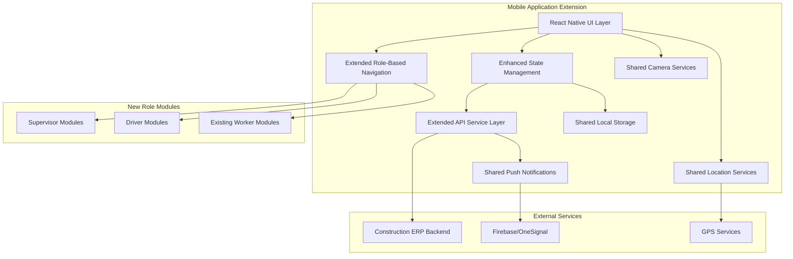

# Design Document: Construction ERP Mobile Application - Supervisor and Driver Extension

## Overview

This design document specifies the extension of the existing Construction ERP Mobile Application to support Supervisor and Driver roles while maintaining full backward compatibility with existing Worker functionality. The extension follows the established React Native architecture and integrates seamlessly with the existing backend system through role-specific API endpoints.

The design emphasizes modular extension rather than replacement, ensuring that existing Worker modules remain untouched while adding comprehensive Supervisor and Driver capabilities. The extension maintains the same construction-optimized UX principles, offline-first approach, and location-aware operations established in the base application.

### Key Design Principles

- **Backward Compatibility**: Zero impact on existing Worker functionality and modules
- **Modular Extension**: New Supervisor and Driver modules integrate with existing architecture
- **Role-Based Segregation**: Clear separation of concerns between user roles
- **API Consistency**: Follows established API integration patterns for new endpoints
- **Shared Components**: Reuses existing common components and utilities where possible
- **Construction-Optimized UX**: Maintains large touch targets and field-friendly design

## Architecture

### Extended High-Level Architecture



### Technology Stack (Extended)

The extension maintains the existing technology stack while adding role-specific enhancements:

- **Framework**: React Native (existing version maintained)
- **Language**: TypeScript with extended type definitions for new roles
- **Navigation**: React Navigation v6 with additional role-based navigators
- **HTTP Client**: Axios with extended API service classes
- **State Management**: React Context API with new role-specific contexts
- **Local Storage**: AsyncStorage (shared with existing implementation)
- **Location Services**: Existing LocationService (shared across roles)
- **Camera**: Existing CameraService (shared across roles)
- **Push Notifications**: Existing notification system (extended for role-specific alerts)
- **UI Components**: Existing ConstructionTheme and common components (reused)

### Extended Application Structure

```
src/
├── components/                 # Existing + Extended components
│   ├── common/                # Existing common components (UNCHANGED)
│   ├── forms/                 # Existing form components (UNCHANGED)
│   ├── cards/                 # Existing + New role-specific cards
│   ├── dashboard/             # Existing + New dashboard components
│   ├── supervisor/            # NEW: Supervisor-specific components
│   │   ├── TeamManagementCard.tsx
│   │   ├── AttendanceMonitorCard.tsx
│   │   ├── TaskAssignmentCard.tsx
│   │   ├── ApprovalQueueCard.tsx
│   │   └── ProgressReportCard.tsx
│   └── driver/                # NEW: Driver-specific components
│       ├── TransportTaskCard.tsx
│       ├── RouteMapCard.tsx
│       ├── WorkerManifestCard.tsx
│       └── VehicleStatusCard.tsx
├── screens/                   # Existing + Extended screens
│   ├── auth/                  # Existing auth screens (UNCHANGED)
│   ├── worker/                # Existing worker screens (UNCHANGED)
│   ├── supervisor/            # NEW: Supervisor screens
│   │   ├── SupervisorDashboard.tsx (ENHANCED)
│   │   ├── TeamManagementScreen.tsx
│   │   ├── AttendanceMonitoringScreen.tsx
│   │   ├── TaskAssignmentScreen.tsx
│   │   ├── ProgressReportScreen.tsx
│   │   ├── ApprovalsScreen.tsx
│   │   ├── MaterialsToolsScreen.tsx
│   │   └── SupervisorProfileScreen.tsx
│   └── driver/                # NEW: Driver screens
│       ├── DriverDashboard.tsx (ENHANCED)
│       ├── TransportTasksScreen.tsx
│       ├── TripUpdatesScreen.tsx
│       ├── DriverAttendanceScreen.tsx
│       ├── VehicleInfoScreen.tsx
│       └── DriverProfileScreen.tsx
├── navigation/                # Extended navigation
│   ├── AppNavigator.tsx       # Enhanced with new role routing
│   ├── WorkerNavigator.tsx    # Existing (UNCHANGED)
│   ├── SupervisorNavigator.tsx # ENHANCED with full navigation
│   └── DriverNavigator.tsx    # ENHANCED with full navigation
├── services/                  # Extended services
│   ├── api/                   # Extended API services
│   │   ├── WorkerApiService.ts # Existing (UNCHANGED)
│   │   ├── SupervisorApiService.ts # NEW
│   │   ├── DriverApiService.ts # NEW
│   │   └── client.ts          # Enhanced with role-based interceptors
│   ├── location/              # Existing location services (SHARED)
│   ├── camera/                # Existing camera services (SHARED)
│   └── notifications/         # Enhanced notification services
├── store/                     # Extended state management
│   ├── context/               # Extended contexts
│   │   ├── AuthContext.tsx    # Enhanced with role-specific data
│   │   ├── SupervisorContext.tsx # NEW
│   │   ├── DriverContext.tsx  # NEW
│   │   ├── LocationContext.tsx # Existing (SHARED)
│   │   └── OfflineContext.tsx # Enhanced for all roles
│   └── types/                 # Extended type definitions
└── types/                     # Extended global types
    └── index.ts               # Enhanced with Supervisor/Driver types
```

## Components and Interfaces

### Extended Core Components

#### 1. Enhanced Authentication System

**AuthProvider (Enhanced)**: Extended to handle role-specific authentication
- Maintains existing Worker authentication (unchanged)
- Adds Supervisor and Driver role detection and routing
- Preserves existing JWT token management
- Extends user state with role-specific permissions

**AuthGuard (Enhanced)**: Extended for multi-role protection
- Maintains existing Worker route protection
- Adds Supervisor and Driver route validation
- Implements role-based access control for new features

#### 2. New Supervisor API Service Layer

**SupervisorApiService**: New service class for supervisor operations
- Team management and worker oversight endpoints
- Task assignment and progress monitoring APIs
- Approval workflow and request management calls
- Progress reporting and documentation endpoints
- Material and tool allocation management APIs

#### 3. New Driver API Service Layer

**DriverApiService**: New service class for driver operations
- Transport task and route management endpoints
- Worker pickup and drop-off confirmation APIs
- Trip status updates and delay reporting calls
- Vehicle information and maintenance logging endpoints
- Driver attendance and performance tracking APIs

#### 4. Enhanced Navigation System

**SupervisorNavigator (Enhanced)**: Full supervisor navigation implementation
- Dashboard with team overview and alerts
- Team management with worker monitoring
- Task assignment with progress tracking
- Progress reports with photo documentation
- Approvals queue with request management
- Profile with supervisor-specific settings

**DriverNavigator (Enhanced)**: Full driver navigation implementation
- Dashboard with transport tasks and vehicle status
- Transport management with route optimization
- Trip updates with real-time status reporting
- Attendance tracking with location validation
- Vehicle information with maintenance alerts
- Profile with driver-specific settings

#### 5. New Role-Specific Context Providers

**SupervisorProvider**: Context for supervisor-specific state
- Team data and worker assignments
- Pending approvals and request queues
- Progress tracking and reporting state
- Material and tool allocation data

**DriverProvider**: Context for driver-specific state
- Transport tasks and route information
- Worker manifests and pickup schedules
- Vehicle assignments and status data
- Trip history and performance metrics

### Extended Interface Definitions

#### Supervisor API Response Interfaces

```typescript
interface SupervisorDashboardResponse {
  projects: Array<{
    id: number;
    name: string;
    workforceCount: number;
    attendanceSummary: {
      present: number;
      absent: number;
      late: number;
      total: number;
    };
    progressSummary: {
      overallProgress: number;
      dailyTarget: number;
      completedTasks: number;
      totalTasks: number;
    };
  }>;
  pendingApprovals: {
    leaveRequests: number;
    materialRequests: number;
    toolRequests: number;
    urgent: number;
  };
  alerts: Array<{
    id: number;
    type: 'safety' | 'geofence' | 'attendance' | 'urgent_request';
    message: string;
    priority: 'low' | 'medium' | 'high' | 'critical';
    timestamp: string;
  }>;
}

interface TeamMember {
  id: number;
  name: string;
  role: string;
  attendanceStatus: 'present' | 'absent' | 'late' | 'on_break';
  currentTask: {
    id: number;
    name: string;
    progress: number;
  } | null;
  location: {
    latitude: number;
    longitude: number;
    insideGeofence: boolean;
    lastUpdated: string;
  };
  certifications: Array<{
    name: string;
    status: 'active' | 'expiring' | 'expired';
    expiryDate: string;
  }>;
}

interface TaskAssignmentRequest {
  workerId: number;
  taskId: number;
  priority: 'low' | 'normal' | 'high' | 'urgent';
  estimatedHours: number;
  instructions: string;
  requiredSkills: string[];
  dependencies: number[];
}

interface ProgressReport {
  reportId: string;
  date: string;
  projectId: number;
  manpowerUtilization: {
    totalWorkers: number;
    activeWorkers: number;
    productivity: number;
    efficiency: number;
  };
  progressMetrics: {
    overallProgress: number;
    milestonesCompleted: number;
    tasksCompleted: number;
    hoursWorked: number;
  };
  issues: Array<{
    type: 'safety' | 'quality' | 'delay' | 'resource';
    description: string;
    severity: 'low' | 'medium' | 'high' | 'critical';
    status: 'open' | 'in_progress' | 'resolved';
  }>;
  materialConsumption: Array<{
    materialId: number;
    name: string;
    consumed: number;
    remaining: number;
    unit: string;
  }>;
  photos: Array<{
    photoId: string;
    category: 'progress' | 'issue' | 'completion';
    url: string;
    timestamp: string;
  }>;
}
```

#### Driver API Response Interfaces

```typescript
interface DriverDashboardResponse {
  todaysTransportTasks: Array<{
    taskId: number;
    route: string;
    pickupTime: string;
    pickupLocation: {
      name: string;
      address: string;
      coordinates: {
        latitude: number;
        longitude: number;
      };
    };
    dropoffLocation: {
      name: string;
      address: string;
      coordinates: {
        latitude: number;
        longitude: number;
      };
    };
    workerCount: number;
    status: 'pending' | 'en_route_pickup' | 'pickup_complete' | 'en_route_dropoff' | 'completed';
  }>;
  assignedVehicle: {
    id: number;
    plateNumber: string;
    model: string;
    capacity: number;
    fuelLevel: number;
    maintenanceStatus: 'good' | 'due_soon' | 'overdue';
  };
  performanceMetrics: {
    onTimePerformance: number;
    completedTrips: number;
    totalDistance: number;
    fuelEfficiency: number;
  };
}

interface TransportTask {
  taskId: number;
  route: string;
  pickupLocations: Array<{
    locationId: number;
    name: string;
    address: string;
    coordinates: {
      latitude: number;
      longitude: number;
    };
    workerManifest: Array<{
      workerId: number;
      name: string;
      phone: string;
      checkedIn: boolean;
      checkInTime?: string;
    }>;
    estimatedPickupTime: string;
    actualPickupTime?: string;
  }>;
  dropoffLocation: {
    name: string;
    address: string;
    coordinates: {
      latitude: number;
      longitude: number;
    };
    estimatedArrival: string;
    actualArrival?: string;
  };
  status: 'pending' | 'en_route_pickup' | 'pickup_complete' | 'en_route_dropoff' | 'completed';
  totalWorkers: number;
  checkedInWorkers: number;
}

interface VehicleInfo {
  id: number;
  plateNumber: string;
  model: string;
  year: number;
  capacity: number;
  currentMileage: number;
  fuelLevel: number;
  maintenanceSchedule: Array<{
    type: 'oil_change' | 'tire_rotation' | 'inspection' | 'major_service';
    dueDate: string;
    dueMileage: number;
    status: 'upcoming' | 'due' | 'overdue';
  }>;
  fuelLog: Array<{
    date: string;
    amount: number;
    cost: number;
    mileage: number;
    location: string;
  }>;
}
```

## Data Models

### Extended User and Authentication Models

```typescript
// Enhanced User interface with role-specific data
interface User {
  id: number;
  employeeId: string;
  name: string;
  email: string;
  phone: string;
  role: UserRole;
  profileImage?: string;
  certifications: Certification[];
  workPass: WorkPass;
  
  // Role-specific data
  supervisorData?: {
    assignedProjects: number[];
    teamMembers: number[];
    approvalLevel: 'basic' | 'advanced' | 'senior';
    specializations: string[];
  };
  
  driverData?: {
    licenseNumber: string;
    licenseClass: string;
    licenseExpiry: Date;
    assignedVehicles: number[];
    certifications: string[];
  };
}

// Enhanced AuthState with role-specific contexts
interface AuthState {
  isAuthenticated: boolean;
  user: User | null;
  company: Company | null;
  token: string | null;
  refreshToken: string | null;
  tokenExpiry: Date | null;
  permissions: string[];
  isLoading?: boolean;
  error?: string | null;
  
  // Role-specific state
  supervisorContext?: SupervisorContextData;
  driverContext?: DriverContextData;
}
```

### Supervisor-Specific Data Models

```typescript
interface SupervisorContextData {
  assignedProjects: Project[];
  teamMembers: TeamMember[];
  pendingApprovals: PendingApproval[];
  dailyReports: SupervisorReport[];
  materialRequests: MaterialRequest[];
  toolAllocations: ToolAllocation[];
}

interface PendingApproval {
  id: number;
  requestType: 'leave' | 'material' | 'tool' | 'reimbursement' | 'advance_payment';
  requesterId: number;
  requesterName: string;
  requestDate: Date;
  urgency: 'low' | 'normal' | 'high' | 'urgent';
  details: any;
  estimatedCost?: number;
  approvalDeadline?: Date;
}

interface MaterialRequest {
  id: number;
  projectId: number;
  requesterId: number;
  itemName: string;
  category: string;
  quantity: number;
  unit: string;
  urgency: 'low' | 'normal' | 'high' | 'urgent';
  requiredDate: Date;
  purpose: string;
  justification: string;
  estimatedCost?: number;
  status: 'pending' | 'approved' | 'rejected' | 'delivered';
}

interface ToolAllocation {
  id: number;
  toolId: number;
  toolName: string;
  allocatedTo: number;
  allocatedToName: string;
  allocationDate: Date;
  expectedReturnDate: Date;
  actualReturnDate?: Date;
  condition: 'good' | 'fair' | 'needs_maintenance' | 'damaged';
  location: string;
}
```

### Driver-Specific Data Models

```typescript
interface DriverContextData {
  assignedVehicle: VehicleInfo;
  todaysRoutes: TransportTask[];
  tripHistory: TripRecord[];
  performanceMetrics: DriverPerformance;
  maintenanceAlerts: MaintenanceAlert[];
}

interface TripRecord {
  tripId: number;
  date: Date;
  route: string;
  pickupLocations: string[];
  dropoffLocation: string;
  totalWorkers: number;
  actualPickupTime: Date;
  actualDropoffTime: Date;
  totalDistance: number;
  fuelUsed: number;
  delays: Array<{
    reason: string;
    duration: number;
    location: string;
  }>;
  status: 'completed' | 'cancelled' | 'incident';
}

interface DriverPerformance {
  onTimePerformance: number;
  totalTripsCompleted: number;
  totalDistance: number;
  averageFuelEfficiency: number;
  safetyScore: number;
  customerRating: number;
  incidentCount: number;
}

interface MaintenanceAlert {
  id: number;
  vehicleId: number;
  type: 'scheduled' | 'urgent' | 'overdue';
  description: string;
  dueDate: Date;
  dueMileage?: number;
  priority: 'low' | 'medium' | 'high' | 'critical';
  estimatedCost?: number;
}
```

### Enhanced Application State Models

```typescript
interface ExtendedAppState {
  auth: AuthState;
  location: LocationState; // Shared across all roles
  offline: OfflineState;   // Enhanced for all roles
  
  // Existing Worker state (unchanged)
  worker?: {
    tasks: TaskState;
    attendance: AttendanceState;
  };
  
  // New Supervisor state
  supervisor?: {
    team: TeamState;
    approvals: ApprovalState;
    reports: ReportState;
    materials: MaterialState;
  };
  
  // New Driver state
  driver?: {
    transport: TransportState;
    vehicle: VehicleState;
    trips: TripState;
    performance: PerformanceState;
  };
}

interface TeamState {
  members: TeamMember[];
  attendanceData: AttendanceRecord[];
  taskAssignments: TaskAssignment[];
  isLoading: boolean;
  error: string | null;
  lastUpdated: Date | null;
}

interface TransportState {
  todaysTasks: TransportTask[];
  activeTask: TransportTask | null;
  routeOptimization: RouteData | null;
  workerManifests: WorkerManifest[];
  isLoading: boolean;
  error: string | null;
}
```

Now let me continue with the Correctness Properties section. First, I need to use the prework tool to analyze the acceptance criteria:

<function_calls>
<invoke name="prework">
<parameter name="featureName">construction-erp-supervisor-driver-extension

## Correctness Properties

*A property is a characteristic or behavior that should hold true across all valid executions of a system—essentially, a formal statement about what the system should do. Properties serve as the bridge between human-readable specifications and machine-verifiable correctness guarantees.*

### Property Reflection

After analyzing the acceptance criteria, several properties can be consolidated to eliminate redundancy:

**Consolidated Navigation Properties**: Properties 1.1, 1.2, and 1.3 can be combined into a single comprehensive navigation property that tests role-based navigation across all roles.

**Consolidated API Integration Properties**: Properties 13.1, 13.2, 13.4, and 13.5 can be combined into a comprehensive API integration property that covers all role-specific API usage.

**Consolidated Backward Compatibility Properties**: Properties 14.1, 14.2, 14.3, 14.4, and 14.5 can be combined into a single comprehensive backward compatibility property.

### Property 1: Role-Based Navigation Control
*For any* user with a specific role (Worker, Supervisor, Driver), the mobile app should display exactly the navigation tabs appropriate for that role and prevent access to unauthorized screens
**Validates: Requirements 1.1, 1.2, 1.3, 1.4**

### Property 2: Supervisor Dashboard Data Consistency
*For any* supervisor accessing the dashboard, all displayed information (projects, workforce count, attendance summary, pending approvals, alerts) should accurately reflect the current state from the backend system
**Validates: Requirements 2.1, 2.2, 2.3, 2.4, 2.5**

### Property 3: Supervisor Attendance Management
*For any* supervisor viewing attendance monitoring, the system should display accurate real-time worker status, detect attendance issues correctly, and process supervisor decisions properly
**Validates: Requirements 3.1, 3.2, 3.3, 3.4, 3.5**

### Property 4: Supervisor Task Management
*For any* supervisor managing tasks, the system should allow proper task assignment, validation, progress tracking, and issue management through backend integration
**Validates: Requirements 4.1, 4.2, 4.3, 4.4, 4.5**

### Property 5: Driver Dashboard Data Consistency
*For any* driver accessing the dashboard, all displayed information (transport tasks, vehicle assignment, pickup information, routes, worker manifests) should accurately reflect the current state from the backend system
**Validates: Requirements 8.1, 8.2, 8.3, 8.4, 8.5**

### Property 6: Driver Transport Task Management
*For any* driver managing transport tasks, the system should display accurate pickup lists, route information, worker confirmation capabilities, and real-time status updates
**Validates: Requirements 9.1, 9.2, 9.3, 9.4, 9.5**

### Property 7: Role-Specific API Integration
*For any* API call made by supervisor or driver roles, the system should use the correct role-specific backend endpoints, handle errors appropriately, maintain proper validation, and enforce JWT-based permissions
**Validates: Requirements 13.1, 13.2, 13.3, 13.4, 13.5**

### Property 8: Backward Compatibility Preservation
*For any* existing Worker functionality, the system should maintain complete compatibility with all existing screens, API calls, navigation, data models, and workflows without any breaking changes
**Validates: Requirements 14.1, 14.2, 14.3, 14.4, 14.5**

## Error Handling

### Extended API Error Management

The extension builds upon the existing error handling strategy while adding role-specific error management:

**Role-Specific Error Interceptors**: Extended Axios interceptors that:
- Handle Supervisor-specific API errors (team management, approvals, reporting)
- Manage Driver-specific API errors (transport, vehicle, route management)
- Maintain existing Worker error handling (unchanged)
- Provide role-appropriate error messages and recovery options

**Enhanced Error Display Strategy**:
- Supervisor errors: Team management failures, approval processing errors, report submission issues
- Driver errors: Route optimization failures, vehicle status errors, manifest confirmation problems
- Shared errors: Authentication, network, and location errors (consistent across roles)
- Backward compatibility: Worker error handling remains completely unchanged

### Role-Specific Location and GPS Error Handling

**Enhanced GPS Management for Multiple Roles**:
- Supervisor location tracking for site visits and team oversight
- Driver location tracking for route optimization and pickup/dropoff confirmation
- Worker location tracking (existing functionality preserved)
- Consistent GPS accuracy requirements across all roles

**Role-Appropriate Location Guidance**:
- Supervisors: Site access instructions and team location monitoring
- Drivers: Route navigation assistance and pickup location guidance
- Workers: Existing geofence validation and attendance location requirements

### Extended Offline Mode Error Handling

**Multi-Role Connectivity Management**:
- Supervisor offline mode: Cached team data, pending approvals queue, draft reports
- Driver offline mode: Cached route data, worker manifests, trip status queue
- Worker offline mode: Existing functionality preserved
- Cross-role data synchronization when connectivity returns

**Role-Specific Sync Conflict Resolution**:
- Supervisor conflicts: Team assignments, approval decisions, progress reports
- Driver conflicts: Trip status updates, worker confirmations, vehicle logs
- Worker conflicts: Existing task and attendance sync handling
- Priority-based conflict resolution (safety-critical updates first)

## Testing Strategy

### Extended Dual Testing Approach

The testing strategy extends the existing approach to cover new roles while maintaining Worker test coverage:

**Enhanced Unit Testing Focus**:
- Supervisor-specific flows: Team management, task assignment, approval workflows
- Driver-specific flows: Transport management, route optimization, worker confirmation
- Cross-role integration: Shared components, navigation, authentication
- Backward compatibility: Comprehensive Worker functionality regression testing

**Extended Property-Based Testing Focus**:
- Role-based navigation and access control across all three roles
- API integration correctness for Supervisor and Driver endpoints
- Data consistency and state management for new role contexts
- Backward compatibility verification for existing Worker functionality

### Enhanced Property-Based Testing Configuration

**Extended Testing Framework**: Fast-check with role-specific generators
- Supervisor data generators: Team structures, approval workflows, progress metrics
- Driver data generators: Transport routes, vehicle data, worker manifests
- Cross-role generators: User roles, permissions, authentication states
- Backward compatibility generators: Existing Worker data structures (unchanged)

**Extended Test Organization**:
- Role-specific property tests for Supervisor and Driver functionality
- Cross-role integration tests for shared components and services
- Backward compatibility tests ensuring Worker functionality preservation
- Performance tests for multi-role data synchronization

**Enhanced Property Test Examples**:

```typescript
// Property 1: Role-Based Navigation Control
describe('Role-Based Navigation Control', () => {
  it('should display correct navigation for any user role',
    // Feature: construction-erp-supervisor-driver-extension, Property 1: Role-Based Navigation Control
    fc.property(
      fc.record({
        userId: fc.integer(1, 1000),
        role: fc.constantFrom('Worker', 'Supervisor', 'Driver'),
        permissions: fc.array(fc.string())
      }),
      async (user) => {
        // Test navigation display based on role
        const navigation = await getNavigationForRole(user.role);
        const expectedTabs = getExpectedTabsForRole(user.role);
        expect(navigation.tabs).toEqual(expectedTabs);
        
        // Test unauthorized access prevention
        const unauthorizedScreens = getUnauthorizedScreensForRole(user.role);
        for (const screen of unauthorizedScreens) {
          expect(() => navigateToScreen(screen)).toThrow();
        }
      }
    )
  );
});

// Property 7: Role-Specific API Integration
describe('Role-Specific API Integration', () => {
  it('should use correct endpoints and handle errors for any role-specific API call',
    // Feature: construction-erp-supervisor-driver-extension, Property 7: Role-Specific API Integration
    fc.property(
      fc.record({
        role: fc.constantFrom('Supervisor', 'Driver'),
        operation: fc.string(),
        data: fc.object()
      }),
      async (apiCall) => {
        // Test correct endpoint usage
        const expectedEndpoint = getExpectedEndpointForRole(apiCall.role, apiCall.operation);
        const actualEndpoint = await makeApiCall(apiCall.role, apiCall.operation, apiCall.data);
        expect(actualEndpoint).toContain(expectedEndpoint);
        
        // Test error handling
        const errorResponse = await simulateApiError(apiCall.role, apiCall.operation);
        expect(errorResponse.message).toBeDefined();
        expect(errorResponse.roleSpecific).toBe(true);
      }
    )
  );
});
```

### Enhanced Unit Testing Strategy

**Extended Component Testing**:
- Supervisor components: Team management cards, approval queues, progress reports
- Driver components: Transport task cards, route maps, worker manifests
- Shared components: Enhanced common components with role-specific behavior
- Worker components: Existing tests maintained (no changes)

**Extended Integration Testing**:
- Multi-role authentication and navigation flows
- Cross-role data sharing and synchronization
- Role-specific API integration with comprehensive mock scenarios
- Backward compatibility verification for all existing Worker workflows

**Enhanced Platform Testing**:
- Role-specific functionality testing on Android and iOS
- Performance testing with multiple role contexts active
- Memory management testing for extended application state
- Network resilience testing for all role-specific operations

### Extended Test Data Management

**Enhanced Mock Data Strategy**:
- Comprehensive supervisor data: Teams, approvals, reports, materials
- Comprehensive driver data: Routes, vehicles, manifests, performance metrics
- Cross-role scenarios: Multi-user interactions, shared resources
- Worker data: Existing mock data preserved and maintained

**Extended Test Environment Setup**:
- Multi-role test scenarios with realistic data relationships
- Role-specific backend mock services with comprehensive API coverage
- Enhanced offline mode testing for all roles
- Cross-role conflict simulation and resolution testing

### Backward Compatibility Testing Requirements

**Comprehensive Worker Regression Testing**:
- All existing Worker screens must function identically
- All existing Worker API calls must work without modification
- All existing Worker navigation must behave exactly as before
- All existing Worker data models must remain unchanged
- All existing Worker workflows must continue to work properly

**Integration Impact Testing**:
- New role additions must not affect Worker performance
- Shared components must maintain Worker-specific behavior
- Authentication system must preserve Worker login experience
- State management must not interfere with existing Worker state

This comprehensive testing strategy ensures that the extension adds robust Supervisor and Driver functionality while maintaining complete backward compatibility with the existing Worker implementation.