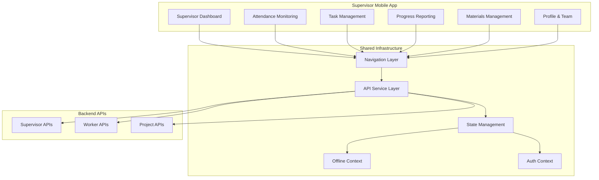

# Design Document: Supervisor Mobile Application

## Overview

The Supervisor Mobile Application is a specialized React Native interface within the Construction ERP Mobile system, designed specifically for site supervisors to manage workers, monitor attendance, assign tasks, and track daily progress across their assigned construction projects. This feature extends the existing mobile application architecture with supervisor-specific functionality while maintaining consistency with the established design patterns.

The supervisor application follows a frontend-only approach, consuming existing backend APIs without modifying backend logic. It provides comprehensive workforce management capabilities through a construction-optimized interface designed for field conditions and rapid decision-making.

### Key Design Principles

- **API-First Integration**: Consume existing supervisor APIs under `/api/supervisor` base path
- **Role-Based Interface**: Supervisor-specific navigation, screens, and functionality
- **Data-Dense Dashboards**: Information-rich displays for quick operational assessment
- **Workforce-Centric Design**: Focus on worker management, attendance monitoring, and task assignment
- **Construction-Field Optimized**: Large touch targets, minimal steps, clear visual indicators
- **Offline-Aware**: Graceful degradation with cached data access in read-only mode

## Architecture

### High-Level Architecture



### Technology Stack Integration

The supervisor application leverages the existing technology stack:

- **Framework**: React Native (existing infrastructure)
- **Language**: TypeScript with supervisor-specific type definitions
- **Navigation**: React Navigation Bottom Tabs + Stack (supervisor-specific routes)
- **HTTP Client**: Axios with supervisor API service layer
- **State Management**: React Context API with supervisor-specific contexts
- **UI Components**: Existing construction-optimized components with supervisor variants
- **Offline Support**: Existing offline context with supervisor data caching

### Supervisor-Specific Architecture Components

**SupervisorNavigator**: Bottom tab navigation with supervisor screens
- Dashboard: Project overview and workforce summary
- Attendance: Real-time worker monitoring and manual overrides
- Tasks: Task assignment and progress tracking
- Reports: Daily progress reporting with photos
- Materials: Local-only materials and tools management (UI placeholder)
- Profile: Supervisor profile and team information

**SupervisorApiService**: Dedicated API service for supervisor endpoints
- Project management APIs (`/api/supervisor/projects`)
- Attendance monitoring APIs (`/attendance-monitoring`, `/late-absent-workers`)
- Task assignment APIs (`/assign-task`, `/update-assignment`)
- Progress reporting APIs (`/daily-progress`, `/daily-progress/photos`)

## Components and Interfaces

### Core Supervisor Components

#### 1. Supervisor Dashboard Components

**SupervisorDashboard**: Main dashboard screen
- Project cards with workforce counts and status indicators
- Attendance summary with late/absent alerts
- Geofence violation indicators
- Quick action buttons for common tasks

**ProjectOverviewCard**: Individual project display component
- Project name, location, and current workforce count
- Attendance status indicators (Present/Late/Absent counts)
- Quick navigation to project-specific screens
- Last update timestamp display

**WorkforceAlertsCard**: Alert summary component
- Late worker count with visual indicators
- Absent worker count with escalation options
- Geofence violation count with location details
- Tap-to-navigate to detailed attendance monitoring

#### 2. Attendance Monitoring Components

**AttendanceMonitoringScreen**: Real-time worker attendance interface
- Worker list with current status (Present/Late/Absent/Outside Geofence)
- Manual attendance override capabilities
- Refresh and export functionality
- Filter and search capabilities

**WorkerAttendanceCard**: Individual worker attendance display
- Worker name, photo, and current status
- Check-in/check-out times with location validation
- Manual override button (when permitted)
- Geofence status indicator

**AttendanceOverrideModal**: Manual attendance correction interface
- Worker selection and reason input
- Location override options
- Supervisor authorization confirmation
- Audit trail documentation

#### 3. Task Management Components

**TaskAssignmentScreen**: Task assignment and management interface
- Available tasks list with project context
- Worker assignment interface with drag-and-drop or selection
- Daily target setting capabilities
- Task dependency visualization

**TaskAssignmentCard**: Individual task assignment component
- Task details with work area and priority
- Worker assignment status and progress
- Quick reassignment and target adjustment
- Overtime instruction capabilities

**WorkerTaskOverview**: Worker-centric task view
- Individual worker's current and queued tasks
- Progress tracking and completion status
- Task sequence and dependency indicators
- Performance metrics display

#### 4. Progress Reporting Components

**DailyProgressScreen**: Daily progress report creation interface
- Manpower utilization input with photo support
- Work progress percentage tracking
- Issue documentation with safety observations
- Material consumption notes (text-only)

**ProgressPhotoManager**: Photo management for progress reports
- Camera capture and gallery selection
- Photo categorization (work progress, issues, safety)
- Photo annotation and description
- Upload progress and error handling

**ProgressReportHistory**: Historical progress report viewer
- Date range selection and filtering
- Report summary cards with key metrics
- Photo gallery view for visual progress tracking
- Export and sharing capabilities

#### 5. Materials Management Components (UI-Only)

**MaterialsRequestScreen**: Material request interface (local state only)
- Material request form with item categorization
- Quantity and urgency specification
- Local storage for draft requests
- Placeholder for future backend integration

**ToolsManagementScreen**: Tools tracking interface (local state only)
- Tool allocation and usage logging
- Return and maintenance tracking
- Local storage for tool status
- Placeholder for future backend integration

### Interface Definitions

#### Supervisor-Specific API Interfaces

```typescript
interface SupervisorProject {
  id: number;
  name: string;
  code: string;
  location: string;
  workforceCount: {
    total: number;
    present: number;
    late: number;
    absent: number;
    outsideGeofence: number;
  };
  geofence: {
    latitude: number;
    longitude: number;
    radius: number;
  };
  supervisor: {
    id: number;
    name: string;
    phone: string;
    email: string;
  };
  lastUpdated: string;
}

interface AttendanceMonitoring {
  workers: WorkerAttendanceStatus[];
  summary: {
    totalAssigned: number;
    present: number;
    late: number;
    absent: number;
    geofenceViolations: number;
  };
  lastRefresh: string;
}

interface WorkerAttendanceStatus {
  workerId: number;
  name: string;
  employeeId: string;
  profileImage?: string;
  status: 'present' | 'late' | 'absent' | 'outside_geofence';
  checkInTime?: string;
  checkOutTime?: string;
  location?: {
    latitude: number;
    longitude: number;
    insideGeofence: boolean;
    distanceFromSite: number;
  };
  canManualOverride: boolean;
}

interface TaskAssignmentRequest {
  workerId: number;
  taskId: number;
  projectId: number;
  dailyTarget?: {
    description: string;
    quantity: number;
    unit: string;
    targetCompletion: number;
  };
  supervisorInstructions?: string;
  priority: 'low' | 'normal' | 'high' | 'urgent';
}

interface DailyProgressReport {
  projectId: number;
  date: string;
  manpowerUsed: {
    planned: number;
    actual: number;
    overtime: number;
  };
  workProgress: {
    overallPercentage: number;
    completedTasks: number;
    inProgressTasks: number;
    queuedTasks: number;
  };
  photos: ProgressPhoto[];
  issues: SafetyObservation[];
  materialConsumption: MaterialNote[];
  supervisorNotes: string;
}

interface ProgressPhoto {
  id: string;
  category: 'work_progress' | 'safety_issue' | 'material_delivery' | 'quality_check';
  description: string;
  location?: GeoLocation;
  timestamp: string;
  filePath: string;
}
```

#### Component Props Interfaces

```typescript
interface SupervisorDashboardProps {
  projects: SupervisorProject[];
  attendanceSummary: AttendanceSummary;
  geofenceViolations: GeofenceViolation[];
  onProjectSelect: (projectId: number) => void;
  onAttendanceMonitoring: () => void;
  onTaskAssignment: () => void;
}

interface AttendanceMonitoringProps {
  workers: WorkerAttendanceStatus[];
  canManualOverride: boolean;
  onManualOverride: (workerId: number, status: AttendanceStatus, reason: string) => void;
  onRefresh: () => void;
  onExport: () => void;
}

interface TaskAssignmentProps {
  availableTasks: Task[];
  assignedTasks: TaskAssignment[];
  workers: Worker[];
  onAssignTask: (assignment: TaskAssignmentRequest) => void;
  onUpdateAssignment: (assignmentId: number, updates: Partial<TaskAssignment>) => void;
  onSetDailyTarget: (assignmentId: number, target: DailyTarget) => void;
}

interface DailyProgressProps {
  projectId: number;
  existingReport?: DailyProgressReport;
  onSaveReport: (report: DailyProgressReport) => void;
  onUploadPhoto: (photo: File, category: string, description: string) => void;
  onSubmitReport: (reportId: string) => void;
}
```

## Data Models

### Supervisor State Models

```typescript
interface SupervisorState {
  projects: SupervisorProject[];
  currentProject: SupervisorProject | null;
  attendanceData: AttendanceMonitoring | null;
  taskAssignments: TaskAssignment[];
  dailyReports: DailyProgressReport[];
  materialsRequests: MaterialRequest[]; // Local-only
  isLoading: boolean;
  error: string | null;
  lastSync: Date | null;
}

interface SupervisorContext {
  state: SupervisorState;
  actions: {
    loadProjects: () => Promise<void>;
    selectProject: (projectId: number) => void;
    refreshAttendance: () => Promise<void>;
    manualAttendanceOverride: (workerId: number, status: AttendanceStatus, reason: string) => Promise<void>;
    assignTask: (assignment: TaskAssignmentRequest) => Promise<void>;
    updateTaskAssignment: (assignmentId: number, updates: Partial<TaskAssignment>) => Promise<void>;
    setDailyTarget: (assignmentId: number, target: DailyTarget) => Promise<void>;
    createDailyReport: (report: DailyProgressReport) => Promise<void>;
    uploadProgressPhoto: (reportId: string, photo: File, category: string) => Promise<void>;
    exportAttendanceReport: () => Promise<void>;
  };
}
```

### Materials Management Models (Local-Only)

```typescript
interface MaterialRequest {
  id: string; // Local UUID
  projectId: number;
  itemName: string;
  category: 'concrete' | 'steel' | 'wood' | 'electrical' | 'plumbing' | 'finishing' | 'hardware' | 'other';
  quantity: number;
  unit: string;
  urgency: 'low' | 'normal' | 'high' | 'urgent';
  requiredDate: Date;
  purpose: string;
  justification: string;
  status: 'draft' | 'pending_backend'; // Local status only
  createdAt: Date;
  createdBy: number; // Supervisor ID
}

interface ToolUsageLog {
  id: string; // Local UUID
  toolId: string;
  toolName: string;
  workerId: number;
  workerName: string;
  assignedAt: Date;
  returnedAt?: Date;
  condition: 'good' | 'damaged' | 'needs_maintenance';
  notes: string;
  location: string;
  status: 'assigned' | 'returned' | 'missing';
}

interface MaterialDelivery {
  id: string; // Local UUID
  projectId: number;
  supplierName: string;
  deliveryDate: Date;
  items: DeliveryItem[];
  receivedBy: number; // Supervisor ID
  photos: string[]; // Local file paths
  notes: string;
  status: 'received' | 'partial' | 'rejected';
}
```

### Attendance and Task Models

```typescript
interface AttendanceOverride {
  workerId: number;
  originalStatus: AttendanceStatus;
  overrideStatus: AttendanceStatus;
  reason: string;
  supervisorId: number;
  timestamp: Date;
  location?: GeoLocation;
  approvalRequired: boolean;
}

interface TaskAssignment {
  assignmentId: number;
  taskId: number;
  workerId: number;
  projectId: number;
  taskName: string;
  description: string;
  workArea: string;
  priority: 'low' | 'normal' | 'high' | 'urgent';
  status: 'queued' | 'in_progress' | 'completed' | 'blocked' | 'cancelled';
  assignedAt: Date;
  startedAt?: Date;
  completedAt?: Date;
  dailyTarget?: DailyTarget;
  progress: TaskProgress;
  supervisorInstructions: string;
  dependencies: number[];
}

interface DailyTarget {
  description: string;
  quantity: number;
  unit: string;
  targetCompletion: number; // Percentage
  actualCompletion?: number;
  notes?: string;
}

interface TaskProgress {
  percentage: number;
  completed: number;
  remaining: number;
  lastUpdated: Date;
  timeSpent: number; // Minutes
  estimatedTimeRemaining: number; // Minutes
}
```

## Correctness Properties

*A property is a characteristic or behavior that should hold true across all valid executions of a system—essentially, a formal statement about what the system should do. Properties serve as the bridge between human-readable specifications and machine-verifiable correctness guarantees.*

### Property 1: Supervisor Authentication and Project Access
*For any* valid supervisor credentials, successful authentication should result in JWT token storage, supervisor permissions retrieval, and display of only company-scoped assigned projects
**Validates: Requirements 1.1, 1.2, 1.3**

### Property 2: Authentication Error Handling
*For any* authentication failure or token expiry, the supervisor app should display exact backend error messages and prompt for re-authentication while preserving current screen context
**Validates: Requirements 1.4, 1.5**

### Property 3: Dashboard Data Consistency
*For any* supervisor accessing the dashboard, all displayed information (projects, workforce counts, attendance statistics, alerts, geofence violations) should accurately reflect current backend state with automatic refresh and timestamp display
**Validates: Requirements 2.1, 2.2, 2.3, 2.4, 2.5**

### Property 4: Attendance Monitoring Accuracy
*For any* attendance monitoring access, the supervisor app should display real-time worker status, properly highlight late/absent workers, show geofence violations, and provide accurate attendance data refresh
**Validates: Requirements 3.1, 3.2, 3.3, 3.4, 3.6**

### Property 5: Manual Attendance Override
*For any* permitted manual attendance override, the supervisor app should allow attendance correction using proper API endpoints and maintain audit trail of override actions
**Validates: Requirements 3.5**

### Property 6: Attendance Report Export
*For any* attendance export request, the supervisor app should generate proper attendance reports using the backend export API
**Validates: Requirements 3.7**

### Property 7: Task Management Operations
*For any* task management operation (viewing, assigning, updating, setting targets, overtime instructions, completion, removal), the supervisor app should use correct API endpoints and maintain task state consistency
**Validates: Requirements 4.1, 4.2, 4.3, 4.4, 4.5, 4.6, 4.7, 4.8, 4.9**

### Property 8: Daily Progress Reporting
*For any* daily progress report operation (creation, photo upload, historical viewing, date range access), the supervisor app should handle progress data correctly with proper file handling and report retrieval
**Validates: Requirements 5.1, 5.2, 5.3, 5.4, 5.5**

### Property 9: Materials Management Local State
*For any* materials and tools management operation, the supervisor app should maintain local state correctly without backend submissions while providing proper UI interfaces for future integration
**Validates: Requirements 6.1, 6.2, 6.3, 6.4**

### Property 10: Profile and Team Information
*For any* profile or team access, the supervisor app should display assigned sites, derive team information from attendance data, show personal details in read-only format, and display worker contact information with assignments
**Validates: Requirements 7.1, 7.2, 7.3, 7.4, 7.5**

### Property 11: Offline Mode Behavior
*For any* network connectivity loss, the supervisor app should display cached data in read-only mode, disable submissions with clear indicators, auto-refresh on connectivity restoration, and show data freshness with sync timestamps
**Validates: Requirements 8.1, 8.2, 8.3, 8.4, 8.5**

### Property 12: Task Assignment Workflow Efficiency
*For any* common task assignment action, the supervisor app should complete the workflow within 2-3 taps maximum to ensure field operation efficiency
**Validates: Requirements 9.3**

### Property 13: API Integration Compliance
*For any* supervisor API call, the app should use only `/api/supervisor` base path endpoints, display exact backend error messages, include proper JWT tokens in authenticated requests, respect company-scoped data access, and rely on backend validation responses
**Validates: Requirements 10.1, 10.2, 10.3, 10.4, 10.5**

## Error Handling

### Supervisor-Specific Error Management

The supervisor application implements comprehensive error handling tailored to workforce management scenarios:

**API Error Handling Strategy**:
- **Attendance Errors**: Handle geofence validation failures, manual override permission errors, and attendance data inconsistencies
- **Task Assignment Errors**: Manage worker availability conflicts, task dependency violations, and assignment permission errors
- **Progress Reporting Errors**: Handle photo upload failures, report submission errors, and historical data access issues
- **Authentication Errors**: Manage supervisor role validation, project access permissions, and token expiry scenarios

**Supervisor-Specific Error Categories**:

1. **Workforce Management Errors**:
   - Worker not found or not assigned to supervisor
   - Attendance override not permitted for specific workers
   - Geofence validation failures for manual overrides
   - Task assignment conflicts (worker already assigned, task dependencies not met)

2. **Project Access Errors**:
   - Project not assigned to supervisor
   - Company scope violations (accessing other company data)
   - Project status restrictions (inactive projects, completed projects)

3. **Progress Reporting Errors**:
   - Photo upload size or format restrictions
   - Report submission deadline violations
   - Historical report access permissions
   - Date range validation errors

4. **Offline Mode Error Handling**:
   - Queue supervisor actions that require backend validation
   - Prevent critical workforce decisions in offline mode
   - Clear indication of actions that cannot be performed offline
   - Sync conflict resolution for attendance overrides and task assignments

### Error Recovery Strategies

**Automatic Recovery**:
- Retry failed API calls with exponential backoff for network errors
- Auto-refresh attendance data when geofence validation fails
- Automatic token refresh for expired JWT tokens
- Background sync of queued actions when connectivity returns

**User-Guided Recovery**:
- Manual retry options for failed operations with clear error explanations
- Alternative workflows when primary actions fail (e.g., manual attendance when geofence fails)
- Escalation paths for permission errors (contact system administrator)
- Offline mode guidance for critical operations

## Testing Strategy

### Dual Testing Approach for Supervisor Features

The testing strategy combines unit testing for supervisor-specific scenarios with property-based testing for comprehensive workforce management coverage:

**Unit Testing Focus**:
- Supervisor authentication and project access flows
- Attendance monitoring and manual override scenarios
- Task assignment workflows with dependency validation
- Progress reporting with photo upload handling
- Materials management local state operations
- Offline mode behavior for supervisor actions

**Property-Based Testing Focus**:
- Universal properties for supervisor API integration
- Workforce data consistency across different project configurations
- Task assignment validation across various worker and task combinations
- Progress reporting data integrity across different report types
- Authentication and authorization across different supervisor roles

### Supervisor-Specific Testing Configuration

**Property-Based Testing Setup**:
- **Framework**: Fast-check with supervisor-specific generators
- **Custom Generators**: Supervisor credentials, project configurations, worker assignments, task dependencies
- **Test Data**: Realistic workforce scenarios, attendance patterns, task assignment combinations
- **Minimum Iterations**: 100 per property test for comprehensive coverage

**Test Organization**:
```typescript
// Property 1: Supervisor Authentication and Project Access
describe('Supervisor Authentication and Project Access', () => {
  it('should authenticate and load assigned projects for any valid supervisor credentials',
    // Feature: supervisor-mobile-app, Property 1: Supervisor Authentication and Project Access
    fc.property(
      fc.record({
        supervisorId: fc.integer(1, 1000),
        companyId: fc.integer(1, 100),
        projectIds: fc.array(fc.integer(1, 500), { minLength: 1, maxLength: 10 })
      }),
      async (supervisorData) => {
        // Test implementation
      }
    )
  );
});

// Property 4: Attendance Monitoring Accuracy
describe('Attendance Monitoring Accuracy', () => {
  it('should display accurate worker attendance status for any project configuration',
    // Feature: supervisor-mobile-app, Property 4: Attendance Monitoring Accuracy
    fc.property(
      fc.record({
        projectId: fc.integer(1, 500),
        workers: fc.array(fc.record({
          workerId: fc.integer(1, 10000),
          status: fc.constantFrom('present', 'late', 'absent', 'outside_geofence'),
          checkInTime: fc.option(fc.date()),
          location: fc.record({
            latitude: fc.double(-90, 90),
            longitude: fc.double(-180, 180),
            insideGeofence: fc.boolean()
          })
        }), { minLength: 1, maxLength: 50 })
      }),
      async (attendanceData) => {
        // Test implementation
      }
    )
  );
});

// Property 7: Task Management Operations
describe('Task Management Operations', () => {
  it('should handle task assignments correctly for any valid task and worker combination',
    // Feature: supervisor-mobile-app, Property 7: Task Management Operations
    fc.property(
      fc.record({
        taskId: fc.integer(1, 1000),
        workerId: fc.integer(1, 10000),
        projectId: fc.integer(1, 500),
        priority: fc.constantFrom('low', 'normal', 'high', 'urgent'),
        dependencies: fc.array(fc.integer(1, 1000))
      }),
      async (taskAssignment) => {
        // Test implementation
      }
    )
  );
});
```

### Integration Testing for Supervisor Workflows

**End-to-End Supervisor Workflows**:
- Complete attendance monitoring workflow (view → override → export)
- Full task assignment workflow (view tasks → assign to worker → set targets → track progress)
- Daily progress reporting workflow (create report → add photos → submit)
- Materials management workflow (request → acknowledge delivery → track usage)

**API Integration Testing**:
- Supervisor API endpoint validation with mock backend responses
- Authentication flow testing with various supervisor roles and permissions
- Error handling testing with different API failure scenarios
- Offline mode testing with network connectivity simulation

**Performance Testing**:
- Large workforce data handling (100+ workers per project)
- Multiple project management (10+ projects per supervisor)
- Photo upload performance for progress reports
- Real-time attendance monitoring refresh performance

### Mock Data and Test Environment

**Supervisor Test Data Sets**:
- Multiple supervisor profiles with different project assignments
- Various workforce configurations (small teams, large crews, mixed skills)
- Different project types (residential, commercial, infrastructure)
- Attendance patterns (normal, high absenteeism, geofence violations)
- Task assignment scenarios (simple tasks, complex dependencies, urgent assignments)

**Test Environment Configuration**:
- Mock supervisor API responses for all endpoints
- Simulated geofence validation scenarios
- Controlled network connectivity states for offline testing
- Photo upload simulation for progress reporting tests
- Time-based testing for attendance monitoring and reporting deadlines